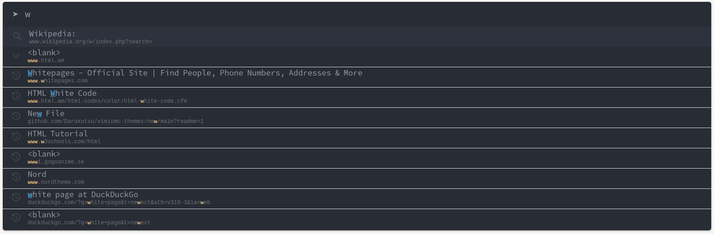
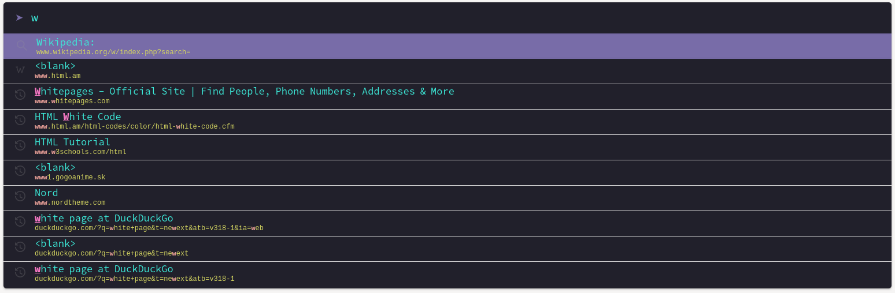
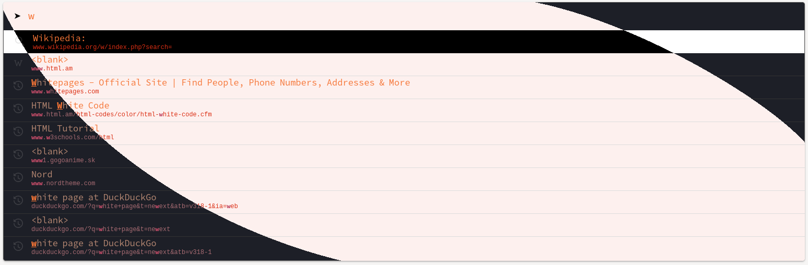
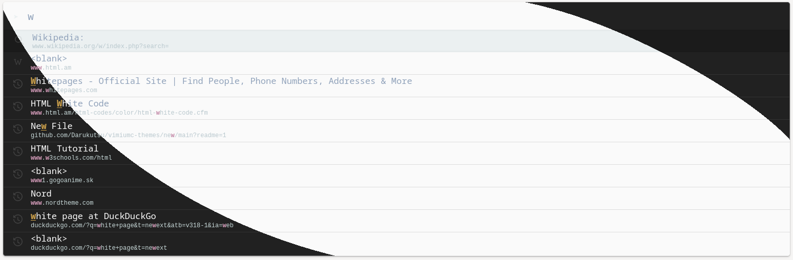
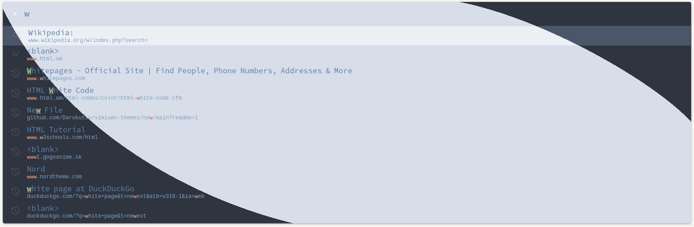
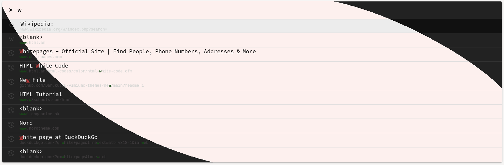
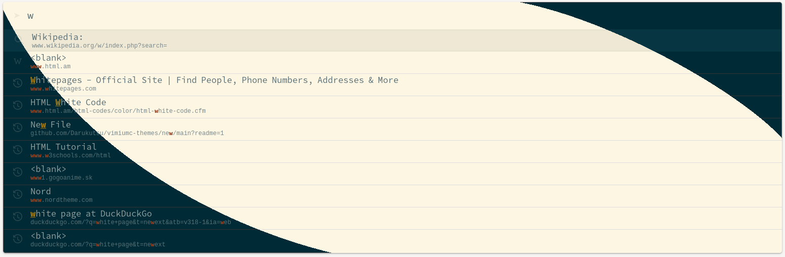
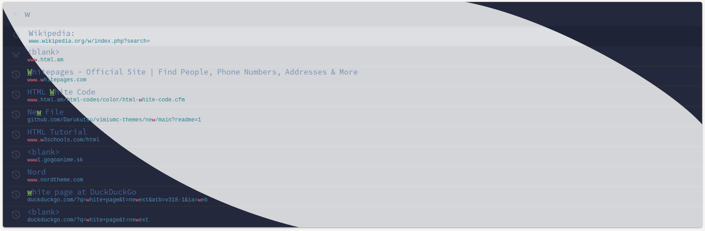
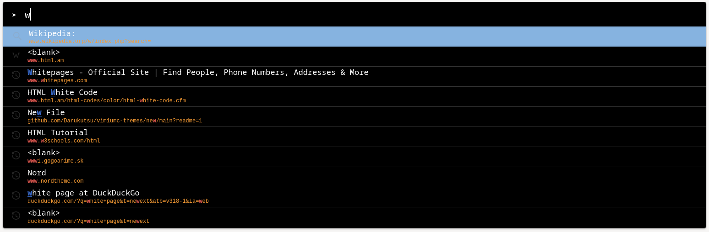
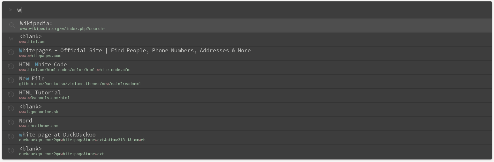

# vimiumc-themes
themes for vimium-c browser extension

This is kinda "fork" of [Foldex idea](https://github.com/Foldex/vimium-dark-themes) since it is pretty hard to find good 
[vimium-c](https://github.com/gdh1995/vimium-c) themes.
CSS files are based on [dermoumi's project](https://github.com/dermoumi/vimium-snow) as he provided good explanation of certain elements.

## **Table of contents**
- [How to create custom theme using script?](#how-to-create-custom-theme-using-script)
- [Installation](#installation)
- [Screenshots](#screenshots)
- [Cons](#cons)

## **How to create custom theme using script?**
I provided [template.css](template.css), [root.css](root.css) & [change-theme.sh](change-theme.sh) (bash script)
to easily create custom theme tailored to your needs.
1. Edit [root.css](root.css)  *optional*
2. Edit [template.css](template.css)  *optional*
3. In your terminal run script with name `./change-theme.sh "name"`. *this differs depending on shell (need bash, sed, cp)*

**!caveats:** all 3 files need to be within same folder/directory.

### **Why script and not `:root{} pseudo-class`?**
The problem with vimium-c CSS is that it must have certain [structure](https://github.com/gdh1995/vimium-c/wiki/Style-the-UI-of-Vimium-C-using-custom-CSS#basic-structure)
and since I am not either CSS coder I solved it with this workaround.

## **Installation**
Choose your desired `vimiumc-theme.css` and place it into `Custom CSS for Vimium C UI` field in `Advance Options`.

## **Screenshots**
[**Doom-One**](themes-css/vimiumc-doom-one.css)

[**Dracula:**](themes-css/vimiumc-dracula.css)

[**Horizon**](themes-css/vimiumc-horizon.css)

[**Material**](themes-css/vimiumc-material.css)

[**Nord**](themes-css/vimiumc-nord.css)

[**Plain**](themes-css/vimiumc-plain.css)

[**Solarized**](themes-css/vimiumc-solarized.css)

[**Tokyo**](themes-css/vimiumc-tokyo-storm.css)

[**Tomorrow Night**](themes-css/vimiumc-tomorrow-night.css)

[**Zenburn**](themes-css/vimiumc-zenburn.css)

## **Cons**
- All themes are rather same. Colors differ.
- Due to bad set of some variables in [template.css](template.css) you might experiece (with some themes) bad readability in `link highlight mode`.
